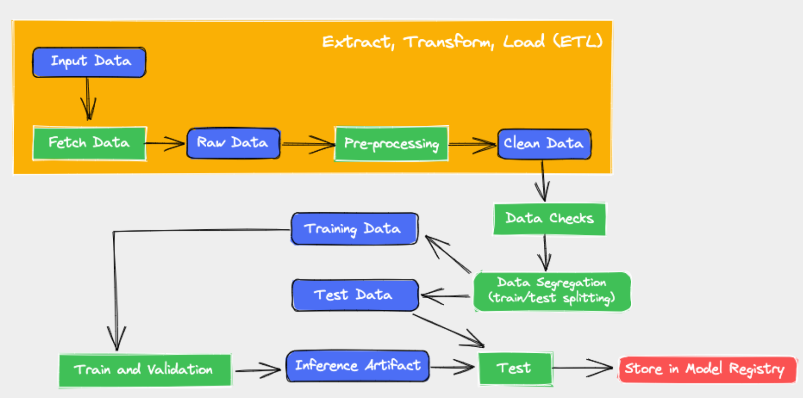

# MLOps com dados do Airbnb: primeiros passos

## Autor: Matheus Rivaldo da Silva



Projeto da disciplina de MLOps da UFRN que tem como objetivo principal colocar em prática o conteúdo referente a Semana 08 da matéria, com o objetivo de construir um pipeline MLOps completo para implementar um modelo AirBnb House Price Prediction (AHPP) em produção

## Requisitos

Certifique-se de atender aos seguintes requisitos:

* Ter instalado `conda 4.8.2 | Python 3.7 ou maior`.
* Ter uma máquina com `Windows | Linux | Mac`.
* Possuir uma conta [wandb](https://wandb.ai/site).

Este projeto usa a ferramenta [wandb](https://wandb.ai/site) que possibilita acompanhar e visualizar todas as partes do seu pipeline de aprendizado de máquina, de conjuntos de dados a modelos de produção.

## Instalando

Criar ambiente do projeto:
```
conda env create -f environment.yml
```

Ativando o ambiente criado:
```
conda activate mlops_exercise
```

## Etapas do projeto

### 1. Conseguir os dados:

Vá para a pasta `01_fetch` e reproduza o comando escrito no arquivo README. Esta etapa fará o download do arquivo do Google Drive passado pelo argumento `input_url`, salvando os dados brutos no wandb como um artefato com as informações passadas por `artifact_name`, `artifact_type` e `artifact_description` em um projeto com nome de acordo com `project_name`.

### 2. Análise exploratória de dados

A pasta `02_eda` possui um jupyter notebook onde você pode explorar sobre o conjunto de dados usado neste projeto.

### 3. Pré-processamento

A pasta `03_clean` possui a etapa em que o conjunto de dados bruto é limpo de acordo com o que descobrimos na análise exploratória de dados.

### 4. Segregação de dados

Para reproduzir esta etapa, vá para a pasta `04_split` e execute o comando escrito no arquivo README

### 5. Data Checks
Na pasta `05_data_checks` somos capazes de realizar um teste de hipótese para rejeitar ou aprovar nossos dados de treinamento/teste. 
